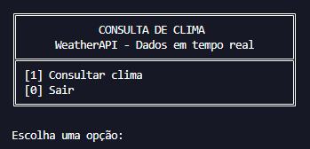

# Consulta de Clima — Python + WeatherAPI

Aplicação de consulta de clima em terminal, desenvolvida em Python com integração à WeatherAPI.  
O programa permite consultar o clima atual de uma cidade e exibir informações como temperatura, sensação térmica, umidade, vento, pressão atmosférica, índice UV, visibilidade e última atualização dos dados.

## Visão geral

O projeto foi construído como uma aplicação de terminal organizada, leve e funcional.  
A consulta é feita por meio de uma API externa, e a chave de acesso é carregada com segurança a partir de um arquivo `.env`.

A interface foi pensada para ser direta e fácil de usar, com menu numerado, mensagens padronizadas e validações para evitar consultas inválidas ou falhas inesperadas durante o uso.

## Funcionalidades

- Consultar o clima atual de uma cidade
- Exibir dados de localização
- Exibir condição climática atual
- Exibir temperatura e sensação térmica
- Exibir umidade, vento, pressão atmosférica, índice UV e visibilidade
- Exibir a data e hora da última atualização
- Validar entrada vazia do usuário
- Validar se os dados retornados pela API estão completos
- Tratar erro de conexão com a API
- Tratar respostas inválidas da API
- Tratar erros retornados pela WeatherAPI
- Usar arquivo `.env` para proteger a chave da API

## Menu principal

    [1] Consultar clima
    [0] Sair

## Tecnologias utilizadas

- Python 3
- requests
- python-dotenv
- WeatherAPI
- Terminal / linha de comando

## Bibliotecas e módulos utilizados

O projeto utiliza os seguintes módulos e bibliotecas:

- `os`
- `requests`
- `python-dotenv`

## Como executar

1. Tenha o Python 3 instalado na máquina.

2. Clone este repositório ou baixe os arquivos do projeto.

3. Acesse a pasta do projeto pelo terminal.

4. Instale as dependências:

        pip install -r requirements.txt

5. Crie uma conta na WeatherAPI e gere uma chave de API.

6. Crie um arquivo chamado `.env` na pasta principal do projeto.

7. Dentro do arquivo `.env`, adicione sua chave da API:

        API_KEY=sua_chave_aqui

8. Execute o arquivo principal:

        python consultar_clima.py

## Configuração da API

O projeto usa a WeatherAPI para buscar os dados climáticos.

A chave da API deve ser armazenada no arquivo `.env`, seguindo o modelo abaixo:

    API_KEY=sua_chave_aqui

O repositório possui um arquivo `.env.example` apenas como exemplo de configuração.

## Exemplo de uso

Ao iniciar o programa, o menu principal é exibido no terminal:

    [1] Consultar clima
    [0] Sair

Ao escolher a opção de consulta, o usuário informa o nome de uma cidade.  
Se a cidade for encontrada, o sistema exibe as informações climáticas atuais separadas por seções:

- Localização
- Clima atual
- Vento e ambiente
- Dados atualizados

## Tratamento de erros

O sistema possui validações para lidar com diferentes situações durante a execução:

| Situação | Tratamento |
| --- | --- |
| Cidade vazia | Exibe mensagem solicitando uma cidade válida |
| Falha de conexão | Exibe erro informando que não foi possível conectar à API |
| Resposta inválida | Exibe erro quando a resposta da API não está no formato esperado |
| Cidade não encontrada | Exibe mensagem traduzida para o usuário |
| API Key ausente | Exibe erro de configuração antes de iniciar o programa |
| API Key inválida | Exibe mensagem de erro retornada pela WeatherAPI |
| Dados incompletos | Impede a exibição e informa que os dados retornados estão incompletos |

## Segurança

O arquivo `.env` não deve ser enviado para o GitHub, pois contém a chave privada da API.

Por isso, o projeto utiliza:

| Arquivo | Função |
| --- | --- |
| `.env` | Armazena a chave real da API localmente |
| `.env.example` | Mostra o modelo de configuração sem expor dados sensíveis |
| `.gitignore` | Impede que o `.env` seja enviado ao repositório |

## Destaques do projeto

- Interface em terminal com layout organizado
- Consumo de API externa com Python
- Uso de variáveis de ambiente para proteger a API Key
- Separação do código em funções
- Uso de type hints
- Validação de dados recebidos da API
- Tratamento de erros de conexão e resposta inválida
- Mensagens traduzidas para erros comuns da WeatherAPI
- Organização adequada para publicação no GitHub

## Autor

Desenvolvido por **Davi Delmondes**.
